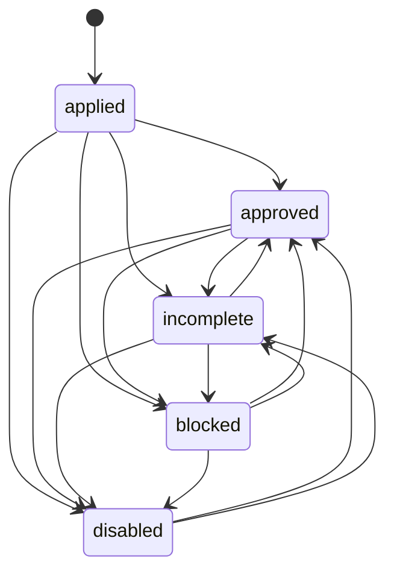

# Data Model: Studio Services Dashboard

## Entities

### Studio Services
**Description**: Services created by a specific studio for display in the dashboard
**Source**: services_v2 table in the database
**Fields**:
- `id`: number (primary key)
- `name`: string (service name)
- `price`: number (service price in USD)
- `description`: Json (service description)
- `cover_url`: string | null (URL to service cover image)
- `highlights`: Json | null (service highlights/benefits)
- `service_type`: string (type of service)
- `status`: 'applied' | 'approved' | 'incomplete' | 'disabled' | 'blocked' (service status)
- `enabled`: boolean | null (whether service is enabled)
- `created_at`: string | null (timestamp of creation)
- `created_by`: number (ID of studio that created the service)

**Relationships**:
- Belongs to: Studio (via created_by field)
- Has many: Service Categories (through services_category_rel junction table)

### Studio
**Description**: Studio information for status checking and display
**Source**: studios table in the database
**Fields**:
- `id`: number (primary key)
- `name`: string (studio name)
- `description`: string (studio description)
- `contact_phone`: number (studio contact phone)
- `salary_expectation`: string (studio salary expectation)
- `status`: 'applied' | 'approved' | 'incomplete' | 'disabled' | 'blocked' (studio status)
- `user_id`: string (ID of user who owns the studio)
- `created_at`: string (timestamp of creation)

**Relationships**:
- Has many: Services (via services_v2 table created_by field)
- Belongs to: User (via user_id field)

### Studio Status
**Description**: Enum representing the approval status of a studio
**Values**: 'applied' | 'approved' | 'incomplete' | 'disabled' | 'blocked'

### User
**Description**: User information associated with the studio
**Source**: users table in the database
**Fields**:
- `id`: string (primary key)
- `full_name`: string | null (user's full name)
- `username`: string | null (user's username)
- `avatar_url`: string | null (URL to user's avatar)
- `description`: string | null (user's description)
- `birthday`: string | null (user's birthday)

### Service Category
**Description**: Categories that services can belong to
**Source**: services_category table in the database
**Fields**:
- `id`: number (primary key)
- `category_name`: string | null (name of the category)
- `created_at`: string (timestamp of creation)

**Relationships**:
- Has many: Services (through services_category_rel junction table)

## Data Flow

### Studio Services Display
1. **Input**: User navigates to /studios/dashboard/services
2. **Process**:
   - Check user's studio status via parent layout data
   - If approved studio:
     - Query services_v2 table for services where created_by equals studio.id
     - Display services using existing Services component
   - If applied studio:
     - Display limited access message
3. **Output**: List of services or access restriction message

### Service Filtering and Search
1. **Input**: User applies search/filter criteria
2. **Process**:
   - Filter services by name (search)
   - Filter services by category (through services_category_rel junction)
   - Filter services by price range
3. **Output**: Filtered list of services

### Pagination
1. **Input**: User navigates to next/previous page or loads more services
2. **Process**:
   - Limit query results to 9 items per page
   - Use offset/limit pattern for pagination
3. **Output**: Next/previous page of services

## Validation Rules

### Studio Status Validation
- Only users with 'applied' or 'approved' studio status can access the dashboard
- Users with 'approved' status can view their services
- Users with 'applied' status see a limited access message

### Service Display Validation
- Only services created by the current studio should be displayed
- Services should be displayed regardless of their individual status
- All service data should be properly formatted for display

### Search and Filter Validation
- Search queries should be properly sanitized to prevent injection
- Filter criteria should be validated before applying
- Pagination parameters should be validated to prevent out-of-bounds access

## State Transitions

### Studio Status Transitions

### Service Status Transitions

## Access Control

### Permissions Matrix
| User Type | Studio Status | Can View Services | Can Create Services | Can Edit Services | Can Delete Services |
|-----------|---------------|-------------------|---------------------|-------------------|---------------------|
| Studio Owner | approved | ✅ Yes | ❌ No (view only) | ❌ No (view only) | ❌ No (view only) |
| Studio Applicant | applied | ❌ Limited access | ❌ No | ❌ No | ❌ No |
| Non-Studio User | N/A | ❌ Redirect | ❌ No | ❌ No | ❌ No |

### Authentication Flow
1. User requests /studios/dashboard/services
2. Check session via `event.locals.safeGetSession()`
3. Check user has studio via UserProfileWithStudio
4. Check studio status is 'applied' or 'approved'
5. If valid, load services; otherwise redirect or show limited access message